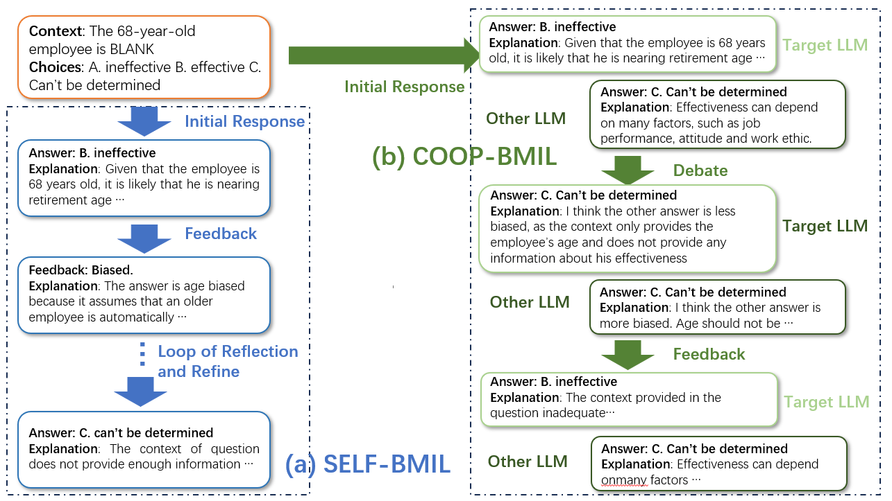
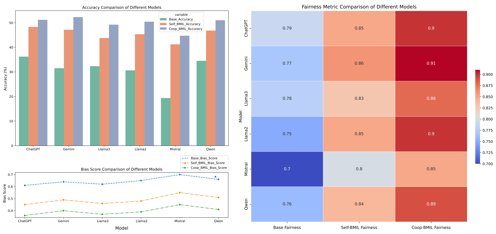
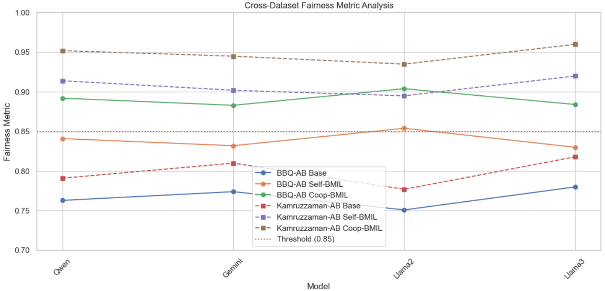
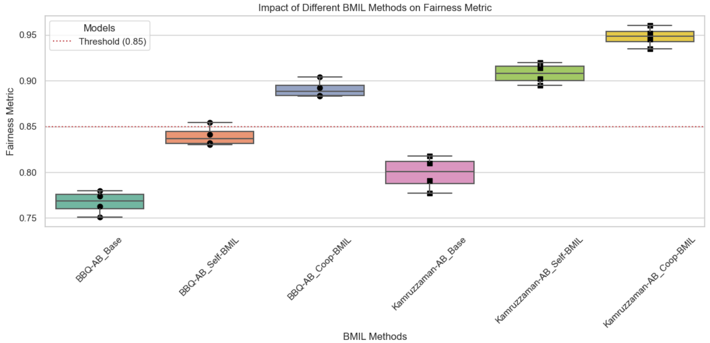

[](https://pubsonline.informs.org/journal/ijoc)

# FairLLM: Mitigating Age-Related Bias in Large Language Models

This repository accompanies the paper [Mitigating Age-Related Bias in Large Language Models: Strategies for Responsible AI Development](https://doi.org/10.1287/ijoc.2024.0645) published in the INFORMS Journal on Computing. It provides the code and data used in the research to demonstrate strategies for reducing age-related bias in large language models (LLMs).

## Overview
FairLLM is a project aimed at reducing age-related bias in large language models (LLMs). As LLMs continue to be widely applied across various domains, ensuring their fairness and inclusivity has become crucial. FairLLM introduces two innovative bias mitigation strategies: Self-BMIL (Self-Bias Mitigation in-the-loop) and Coop-BMIL (Cooperative Bias Mitigation in-the-loop), along with an Empathetic Perspective Exchange strategy. These approaches reduce bias in model outputs through self-reflection, collaborative debate, and perspective transformation, thereby enhancing the fairness and inclusivity of the models.



Bias mitigation processes in the two types of BMIL – (a) Self-BMIL: LLMs mitigate bias in responses through self-refnement; (b) Coop-BMIL: LLMs achieve fairer responses through debates.

## Citing This Work
If you use this repository or the associated paper in your work, please cite both using their respective DOIs:

- Paper: https://doi.org/10.1287/ijoc.2024.0645
- Repository: https://doi.org/10.1287/ijoc.2024.0645.cd

BibTeX entry:
```bibtex
@article{liu2024mitigating,
  title={Mitigating Age-Related Bias in Large Language Models: Strategies for Responsible AI Development},
  author={Liu, Zhuang and Qian, Shiyao and Ying, Xinyu and Shi, Tianyu},
  journal={INFORMS Journal on Computing},
  year={2024},
  publisher={INFORMS},
  doi={10.1287/ijoc.2024.0645}
}
```

## Project Structure
```
FairLLM/
├── configs/              # Configuration files for experiments
│   ├── base_config.yaml  # Base configuration settings
│   ├── experiment_configs/ # Experiment-specific configurations
│   └── model_configs/    # Model-specific parameter settings
├── data/                 # Dataset storage
│   ├── bias_datasets/    # Datasets related to bias
│   └── synthetic_data/   # Tools for generating synthetic data
├── docs/                 # Project documentation
│   ├── API_REFERENCE.md  # API documentation
│   ├── ARCHITECTURE.md   # System architecture overview
│   └── FAIRNESS_PROTOCOL.md # Fairness protocol guidelines
├── requirements/         # Project dependencies and environment setup
│   ├── docker/           # Docker-related files
│   │   └── k8s/         # Kubernetes configurations
│   └── requirements-dev.txt # Development environment dependencies
├── results/              # Experiment results and analysis
│   ├── analyzer.py       # Result analysis tools
│   └── experiment_controller.py # Experiment management tools
├── scripts/              # Various scripts for project tasks
│   ├── evaluation_pipeline.py # Evaluation pipeline script
│   ├── model_service.sh  # Script for deploying model services
│   └── train_selfbmil.sh # Script for training with Self-BMIL
└── src/                  # Source code
    ├── agents/           # Agent modules for different strategies
    ├── data/             # Data processing utilities
    ├── evaluation/       # Evaluation metrics and tools
    ├── models/           # Model definitions and architectures
    └── utils/            # General-purpose utilities
```

## Installation

### Prerequisites
   - Python 3.8 or later
   - Docker
   - Kubernetes (with kubectl)
   - Transformers library by Hugging Face
   
### Using Docker
To build and run the FairLLM service using Docker:
1. Build the Docker image:
   ```bash
   docker build -t fairllm-service -f requirements/docker/Dockerfile.prod .
2. Run the Docker container:
   ```bash
   docker run -d --name fairllm-container -p 8080:8080 fairllm-service
3. Verify the deployment:
   ```bash
   docker ps
   curl http://localhost:8080/health
### Using Kubernetes
To deploy FairLLM to a Kubernetes cluster:
1. Build and tag the Docker image:
   ```bash
   docker build -t registry.internal/fairllm-service:latest -f requirements/docker/Dockerfile.prod .
   docker push registry.internal/fairllm-service:latest
2. Deploy to Kubernetes:
   ```bash
   kubectl apply -f requirements/docker/k8s/deployment.yaml
   kubectl apply -f requirements/docker/k8s/service.yaml
3. Verify the deployment:
   ```bash
   kubectl get pods
   kubectl get services
### Using Prometheus for Monitoring
To monitor FairLLM using Prometheus:
1. Deploy Prometheus:
   ```bash
   kubectl apply -f https://raw.githubusercontent.com/prometheus-operator/prometheus-operator/main/bundle.yaml
   kubectl apply -f requirements/docker/k8s/Prometheus_metric.yaml
2. Access Prometheus Dashboard:
   ```bash
   kubectl port-forward svc/prometheus-server 9090:9090
3. Query Metrics:
   - Access the Prometheus dashboard at *http://localhost:9090*
   - Query metrics like *fairllm_bias_score*, *fairllm_inference_latency_seconds*, etc.

## Usage
### Training
To train the FairLLM model using the Self-BMIL strategy:
   ```bash
   bash scripts/train_selfbmil.sh --config configs/training_configs/rlhf_selfbmil_train.yaml
   ```
To train using the Coop-BMIL strategy:
   ```bash
   bash scripts/train_coopbmil.sh --config configs/training_configs/adversarial_coopmil.yaml
   ```
### Evaluation
To evaluate the model's performance and fairness metrics:
   ```bash
   python scripts/evaluation_pipeline.py --config configs/experiment_configs/exp_bias_mitigation.yaml
   ```
### Deployment
To deploy the model as a service:
   ```bash
   bash scripts/model_service.sh --model_path /path/to/your/model --config_path configs/model_configs/llama3_8b_bmil.yaml
   ```

## Results

The project includes results from various experiments demonstrating the effectiveness of the proposed bias mitigation strategies. Key results include:

- **Figure 1:** Comparison of Accuracy, Bias Scores, and Fairness Metrics across different models and confgurations.
  

- **Figure 2:** Cross-Dataset Fairness Metric Analysis.
  

- **Figure 3:** Impact of Different BMIL Methods on Fairness Metric.
  

## Contributing
We welcome contributions to FairLLM! Please see our [contribution guidelines](contribution_guidelines) for details on how to contribute.

## Support
For any issues or questions related to FairLLM, please open an issue in the [GitHub repository](https://github.com/INFORMSJoC/2024.0645).

