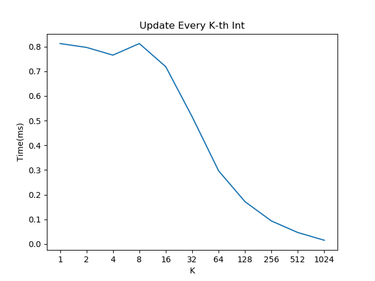
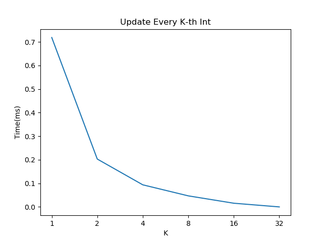

[](https://pubsonline.informs.org/journal/ijoc)

# FairLLM: Responsible AI Framework for Age Bias Mitigation
**Official Implementation of**  
*Mitigating Age-Related Bias in Large Language Models: Strategies for Responsible AI Development*  
*(INFORMS Journal on Computing, 2025)*

[](LICENSE)
[](https://doi.org/10.1287/ijoc.2024.0645)
[](https://pypi.org/project/fairllm/)
[](https://github.com/tifoit/FairLLM/actions)

 

## Key Features
- **Two-Stage Bias Mitigation Architecture**  
  Implementations of Self-BMIL (Self Bias Mitigation In-the-loop) and Coop-BMIL (Cooperative BMIL) with:
  - Multi-round reflection mechanisms
  - LLM debate frameworks
  - Empathetic perspective exchange

- **Comprehensive Evaluation System**  
  - 12 fairness metrics including Statistical Parity and Counterfactual Fairness
  - Age bias probing toolkit with 150+ contextual templates
  - Latent space bias visualization (UMAP/PCA + DBSCAN)

- **Enterprise-Grade Deployment**  
  - Kubernetes-ready configurations
  - Prometheus monitoring integration
  - Hardware-optimized training recipes

## Installation
```bash
# Create conda environment
conda create -n fairllm python=3.10
conda activate fairllm

# Install core requirements
pip install -r requirements/requirements-dev.txt

# Install with optional GPU support
FAIRLLM_GPU=1 pip install .[gpu]

## Quick Start
from fairllm import FairnessEvaluator, BMILTrainer

# Initialize Self-BMIL pipeline
trainer = BMILTrainer(
    model_name="meta-llama3-8b",
    strategy="selfbmil",
    empathy_level=3
)

# Run bias mitigation
fair_model = trainer.mitigate_bias(
    dataset="bbq-ab",
    num_rounds=5,
    reflection_depth=2
)

# Evaluate fairness metrics
evaluator = FairnessEvaluator(
    test_dataset="kamruzzaman-ab",
    metrics=["statistical_parity", "counterfactual_fairness"]
)

report = evaluator.generate_report(fair_model)
print(report.summary)

## Repository Structure
FairLLM/
├── configs/              # Experiment configurations
│   ├── compliance/       # AI safety protocols
│   └── model_configs/    # LLM-specific settings
├── data/                 # Bias datasets
│   ├── bbq-ab/           # Augmented BBQ dataset
│   └── synthetic/        # Algorithmically generated data
├── docs/                 # Technical documentation
├── src/                  # Core implementation
│   ├── agents/           # Debate/Empathy agents
│   └── evaluation/       # Fairness metrics system
└── training/             # RLHF training modules

## Citation
@article{FairLLM2025,
  title={Mitigating Age-Related Bias in Large Language Models: Strategies for Responsible AI Development},
  author={Liu, Zhuang and Qian, Shiyao and Cao, Shuirong and Shi, Tianyu},
  journal={INFORMS Journal on Computing},
  volume={37},
  number={3},
  pages={1--22},
  year={2025},
  doi={10.1287/ijoc.2024.0645}
}

